## LDTS_GR072 - WORLD THRUSTER

### Description

>In this exciting fixed shooter game that resembles the old "Space Invaders", your main objective is to survive the longest amount of time possible. You will control a spaceship and battle several enemies through your journey to the top of the leaderboard.
Are you able to do it?

This project was developed by *José Costa* (up202207871@fe.up.pt)  *Ângelo Oliveira*(up202207798@fe.up.pt) and *Bernardo* (*up202206009@fe.up.pt*) 

### IMPLEMENTED FEATURES

> - **Movement** - The game character will be able to move in all major directions - up , down , left , right 
> - **Movement** - The game character will be able to move in all major directions - up , down , left , right 
> - **Shot** - When the space bar is pressed a beam is shot from the spaceship
> - **Map** - Stars around the map will be well distributed across all screen
> - **Simple Collisions** - No star will be visible if the spaceship is on top of it and the spaceship will not be able to leave the screen
> - **Simples Animation** - When either the right arrow key or left arrow key the spaceship will lean accordingly in order to give the sensation of turning
> - **Simple Menu** - A simple menu where you wil be able to start a game 

### PLANNED FEATURES

> - **Shrinking** - The main character will be able to shrink it's size in order to increase his velocity but reducing the damage and reach of the shot.
>- **Super Shot** - The main character will be able to periodically use a super shot that will be wider and *stronger* than the normal one.
> - **Enemies** - The main game will have several different enemies. The ones planned are:   **normal enemies** : simply shoot in front and stay still;   **asteroids** : which are immortal , can only be dodged and will track the player's position   **kamikazes** : will track the player's position and explode if they collide with the player   **boss** - a bigger and tougher enemy with more health and damage
>- **Rest of the Menu** - Other functionalities of the menu such as Configurations , Instructions , Leaderboard and Exit
>- **Music** - It is planned that both the menu and game will have different musics.
>- **Sounds Effects**  - The game will have sound effects for when the spaceship moves and shot

### Shooting and Enemies Movement Mockup
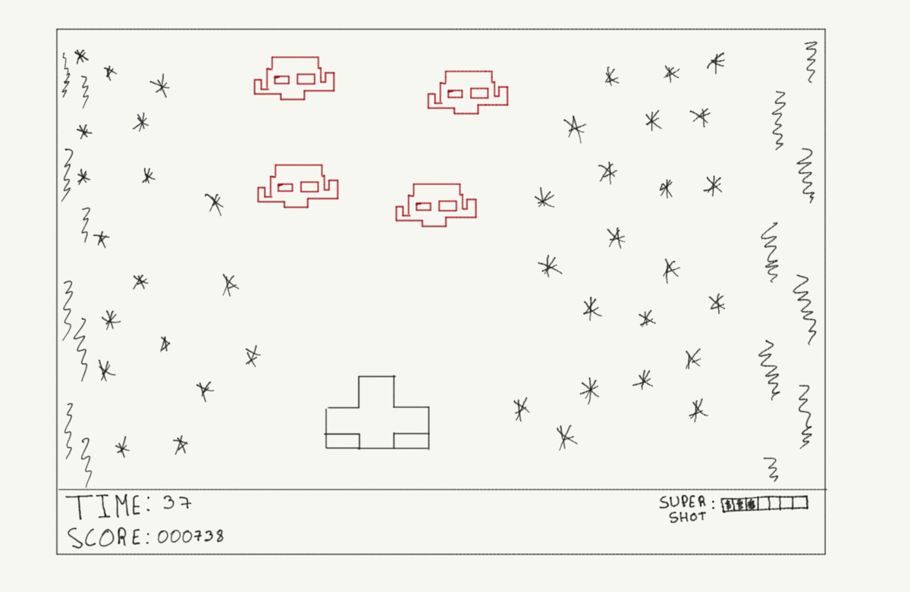

### Asteroids Dodging Mechanic
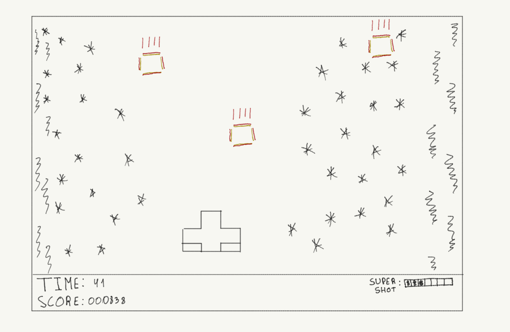

### All Instances of the Menu
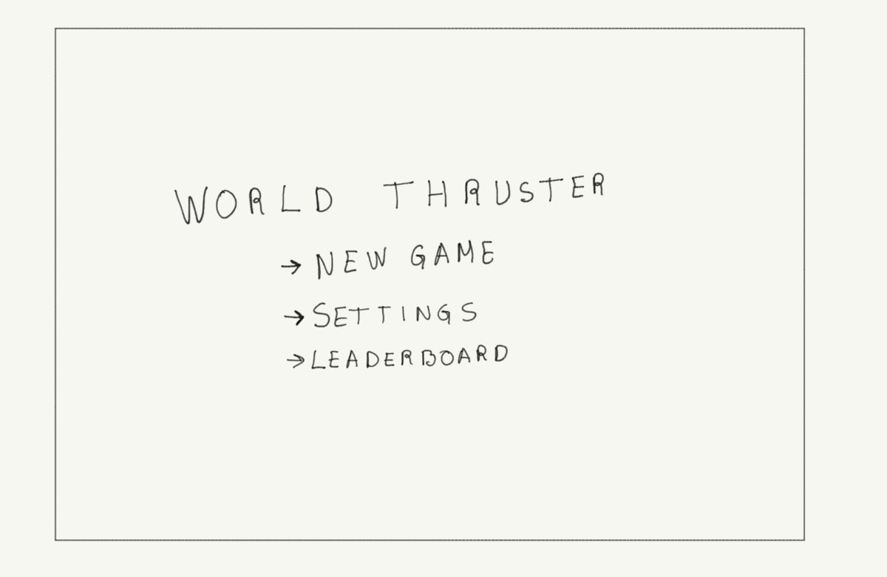

### DESIGN

# Guarantying only one instance of Game

**Singleton**

**Problem in Context:**

Without this pattern, there could have been multiple instances of Game resulting in loss of efficiency, instead, by doing this we going to guarantee that we only have one Game instance and provide global access to that instance. With this single instance we don’t violate principles such as the open/closed principle.

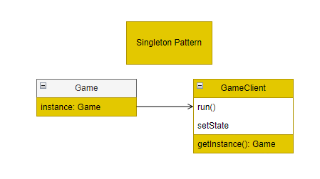

**Consequences:**

> - Single Instance: The Game class ensures that there is only one instance, allowing various components to interact with the same game state.
> - Global Access: The GameClient accesses the singleton instance of the game, providing a unified point of control for game-related actions.
> - Memory Efficiency: The Singleton pattern ensures a single instance, avoiding excessive memory usage while allowing various parts of the system to work with the same game state.

# Gamemode

**State**

**Problem in Context:**

A game usually is divided into different parts, in this game we also decided to divide it into two different states it being GameState (where we have all the behavior associated with the gameplay part) and MenuState ( in which all the configurations and additional necessary information is stored) , this is extremely important since the Game object behavior depends on which state they are currently and that state needs to be changed in run-time. 

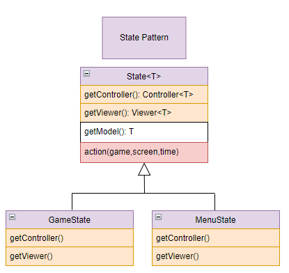

**Consequences:**

> - Encapsulation: Each state encapsulates its behavior, making it easier to add new states without modifying already pre-existing code.
> - Separation of Concerns: The State pattern helps separate the concerns related to different states, helping with a more linear and cleaner design.
> - Flexibility: Adding new states or modifying the behavior of existing states can be done independently, without affecting other parts of the code.

# Playing Music/Sounds depending on the state

**Observer**

**Problem in Context:**

In this game, the sound system needs to react to changes in the game state. For example, when transitioning from a MenuState to an GameState, the audio system music needs update, and certain elements might need to be reset (Main music) or initialized (shot or enemies sound).

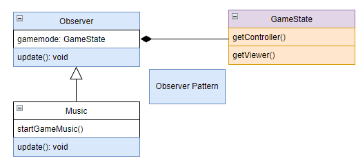

**Consequences:**

> - Loose Coupling: The Observer pattern promotes loose coupling between the game state and its observers. The game state doesn't need to know the specific details of its observers, allowing for easier maintenance and modification.
> - Separation of Concerns: Observers are responsible for their own reactions to state changes which enhances the detachment of certain parts of the code.
> - Unexpected updates: The issue of unexpected updates in the Observer pattern can arise, in this case, when they receive notifications too frequently. This can lead to unnecessary computations, potential performance overhead, and unintended side effects, but it can be with some minor tweaks resolved/mitigated.

# Architectural Pattern

**Model-View-Controller**

**Problem in Context:**

This design pattern in super-useful, since normally is difficult to achieve an architecture early on in a game, that doesn’t need to be changed later in the development, so for this we ensure that we separate all the concerns into their specific area without adding difficulty to maintain, modify or extend, already pre-existing components.
To solve that problem, we implemented the MVC (Model–View–Controller) design pattern, with the following division:

Model - Stores all the data structures of the game and its current state.

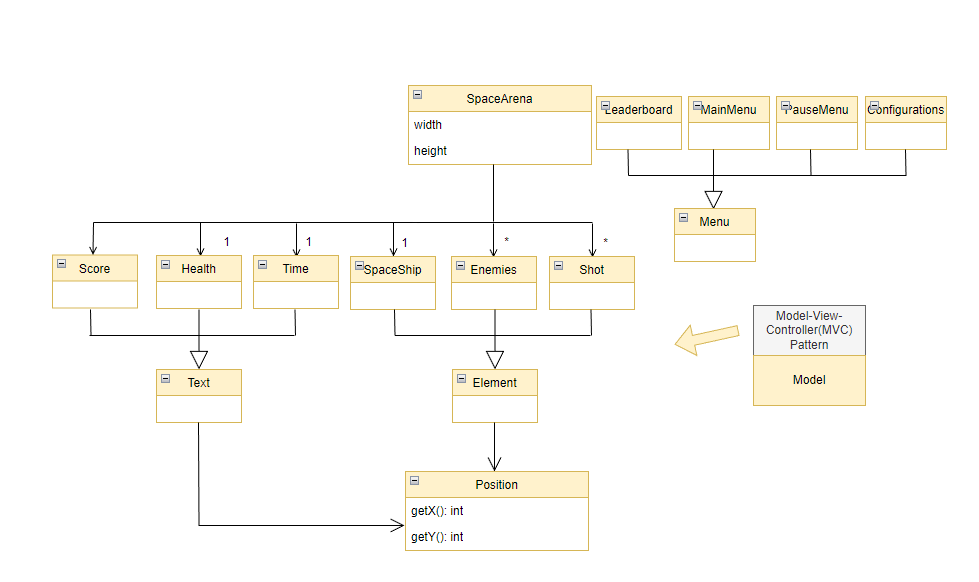

View - Handles the interaction with the player, directly, by the press of a button or indirectly, by a graphical interface that represents the game.

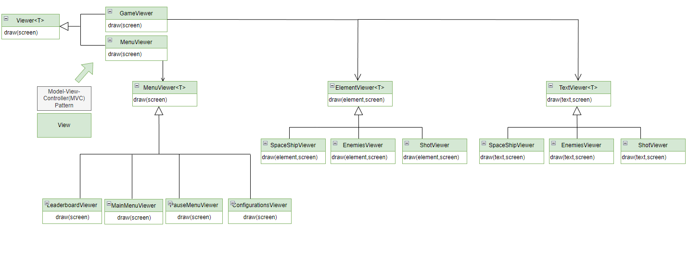

Controller - Coordinates all the changes that occur in the other two.

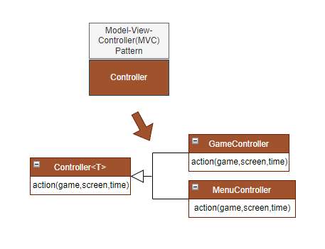

**Consequences:**

> - Flexibility and Extensibility: MVC supports flexibility and extensibility by allowing changes in one component without affecting the others.
> - Better testability: By allowing individual components to be tested in isolation, it helps to identify errors in a simpler way, because testing on instance doesn’t mean we need to test all the others. 
> - Complexity Management: Manages complexity by organizing the code into three distinct components with well-defined responsibilities.

# Localizing which helper subclass is to delegate

**Factory**

**Problem in Context:**

We use the Factory pattern connected with another pattern that we mentioned sooner, the MVC pattern, it allows a class to delegate the responsibility of instantiating its objects to its subclasses, in this case getController() and getViewer().

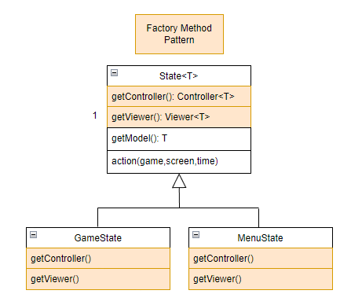

**Consequences:**

> - Complexity: This pattern simplifies client code by abstracting the instantiation details, making it easier to understand and maintain.

# Creating a Game Loop

**Game Loop**

**Problem in Context**

The game loop pattern ensures that the game runs smoothly and consistently, creating a loop that continually processes inputs, renders outputs and updates the state of the game.

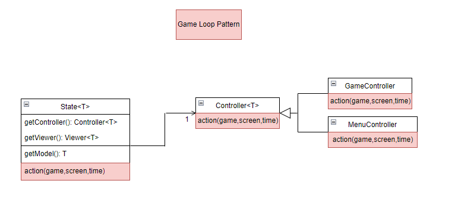

**Consequences**

> - Responsiveness: The game loop contributes to the maintenance of a responsive user experience by continuously monitoring and reacting to user input. Gameplay becomes more fluid and dynamic by processing player actions quickly.
> - Consistent Frame Rate:It aids in maintaining a steady frame rate, which is essential for giving players a fluid visual experience.
> - Energy Consumption: The game loop's constant execution can use up a lot of CPU's power, which reduces the device's energy efficiency. In order to reduce pointless computations and enhance overall energy usage, developers must optimize the loop.

# UML Model Containing all Design Patterns:

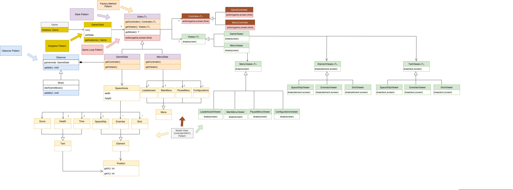

Note: This image is available in the docs folder , it is recommended to open it for full coverage and better view of the design.
