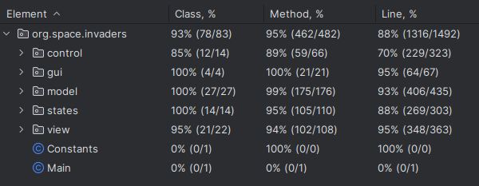
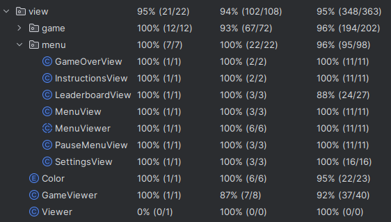

## LDTS_GR072 - WORLD THRUSTER

### Description

>World Thruster is a space-themed game where the main objective is to survive the longest amount of time and accumulate the highest amount of points to climb up the leaderboards. In this game your skills will be tested against several enemies that will try to kill you. If your lives reach end or the enemies get to the Earth that you are trying to protect you lose. Are you up to the challenge?

This project was developed by *José Costa* (up202207871@fe.up.pt)  *Ângelo Oliveira*(up202207798@fe.up.pt) and *Bernardo Sousa* (*up202206009@fe.up.pt*) 

### IMPLEMENTED FEATURES

> - **Movement** - The game character is able to move in all major directions - up , down , left , right.
> - **Shrinking** - The main character is able to shrink it's size in order to increase his velocity but reducing the damage and reach of the shot.
> - **Shot** - When the space bar is pressed a shot is shot from the spaceship. When the spaceship is in mini form thus shot reach and damage will be reduced. 
> - **Map** - Stars around the map are well distributed across all screen. Furthermore, they are random and new ones will be generated in the beginning of each game.
> - **Simple Collisions** - No star will be visible if the spaceship is on top of it and the spaceship will not be able to leave the screen. Furthermore, collisions with enemies and enemies' shots are also implemented, 1 life will be lost for each collision.
> - **Invincibility** - After a collision that results in the loss of a life, the spaceship will be invincible for a short amount o time. In addition, the spaceship will appear white in some parts to indicate that it is invincible.
> - **Menu** - A simple menu where you are able to start a game , check the settings where you can increase , decrease the difficulty or the volume of the music , check the leaderboard and the top 5 scores and the acronym names of the people you did it, and check the instructions of the game.
> - **Pause Menu** - While you are playing if you press esc a pause menu will appear, the game will be paused, and you can either go back to the main menu or resume the game.
> - **Enemies** - The main game has several different enemies. The ones planned are:   
> - **Normal enemies** : simply shoot in front and move;   
> - **Kamikazes** : will track the player's position and explode if they collide with the player   
> - **Strong enemies** - similar to the normal enemies but with more health and slower movement speed.
>- **Music** - The game has two musics, a menu theme and a Game theme that alternate with each other according to the state of the game.

### Game Preview

### Menus

Initial Menu

Instructions Menu

Settings Menu

Leaderboard Menu

GameOver Menu

Pause Menu

### DESIGN

# Guarantying only one instance of Game

**Singleton**

**Problem in Context:**

Without this pattern, there could have been multiple instances of Game resulting in loss of efficiency, instead, by doing this we going to guarantee that we only have one Game instance and provide global access to that instance. With this single instance we don’t violate principles such as the open/closed principle.

**Consequences:**

> - Single Instance: The Game class ensures that there is only one instance, allowing various components to interact with the same game state.
> - Global Access: The GameClient accesses the singleton instance of the game, providing a unified point of control for game-related actions.
> - Memory Efficiency: The Singleton pattern ensures a single instance, avoiding excessive memory usage while allowing various parts of the system to work with the same game state.

# Gamemode

**State**

**Problem in Context:**

A game usually is divided into different parts, in this game we also decided to divide it into two different states it being GameState (where we have all the behavior associated with the gameplay part) and MenuState ( in which all the configurations and additional necessary information is stored) , this is extremely important since the Game object behavior depends on which state they are currently and that state needs to be changed in run-time. 

**Consequences:**

> - Encapsulation: Each state encapsulates its behavior, making it easier to add new states without modifying already pre-existing code.
> - Separation of Concerns: The State pattern helps separate the concerns related to different states, helping with a more linear and cleaner design.
> - Flexibility: Adding new states or modifying the behavior of existing states can be done independently, without affecting other parts of the code.

# Architectural Pattern

**Model-View-Controller**

**Problem in Context:**

This design pattern in super-useful, since normally is difficult to achieve an architecture early on in a game, that doesn’t need to be changed later in the development, so for this we ensure that we separate all the concerns into their specific area without adding difficulty to maintain, modify or extend, already pre-existing components.
To solve that problem, we implemented the MVC (Model–View–Controller) design pattern, with the following division:

Model - Stores all the data structures of the game and its current state.

View - Handles the interaction with the player, directly, by the press of a button or indirectly, by a graphical interface that represents the game.

Controller - Coordinates all the changes that occur in the other two.

**Consequences:**

> - Flexibility and Extensibility: MVC supports flexibility and extensibility by allowing changes in one component without affecting the others.
> - Better testability: By allowing individual components to be tested in isolation, it helps to identify errors in a simpler way, because testing on instance doesn’t mean we need to test all the others. 
> - Complexity Management: Manages complexity by organizing the code into three distinct components with well-defined responsibilities.

# Localizing which helper subclass is to delegate

**Factory**

**Problem in Context:**

We use the Factory pattern connected with another pattern that we mentioned sooner, the MVC pattern, it allows a class to delegate the responsibility of instantiating its objects to its subclasses, in this case getController() and getViewer().

**Consequences:**

> - Complexity: This pattern simplifies client code by abstracting the instantiation details, making it easier to understand and maintain.

# Creating a Game Loop

**Game Loop**

**Problem in Context**

The game loop pattern ensures that the game runs smoothly and consistently, creating a loop that continually processes inputs, renders outputs and updates the state of the game.

**Consequences**

> - Responsiveness: The game loop contributes to the maintenance of a responsive user experience by continuously monitoring and reacting to user input. Gameplay becomes more fluid and dynamic by processing player actions quickly.
> - Consistent Frame Rate:It aids in maintaining a steady frame rate, which is essential for giving players a fluid visual experience.
> - Energy Consumption: The game loop's constant execution can use up a lot of CPU's power, which reduces the device's energy efficiency. In order to reduce pointless computations and enhance overall energy usage, developers must optimize the loop.

# UML Model Containing all Design Patterns:

Note: This image is available in the docs folder , it is recommended to open it for full coverage and better view of the design.

# Tests coverage:

Check the [link](./docs/coverage.html) to HTML file with Coverage Report for more detailed information

### General Test Coverage

### Control Test Coverage

### GUI Test Coverage

### Model Test Coverage

### State Test Coverage

### View Test Coverage

In the event of the tests failing try running them again, and they should all pass.

**Pit Test / Mutation Test**

Check the [link](./docs/pitest.html) to HTML file with Pit Test for more detailed information

### Code Smells 

We were not able to find any code smells

### Self-Evaluation:

**José Costa** 40%  
**Ângelo Oliveira** 40%  
**Bernardo Sousa** 20%